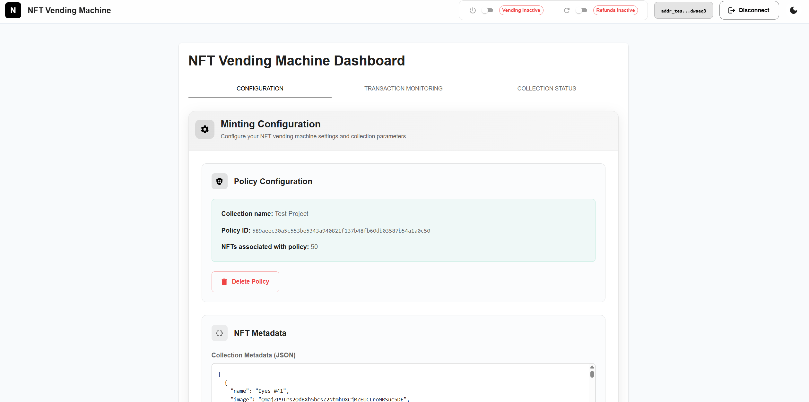
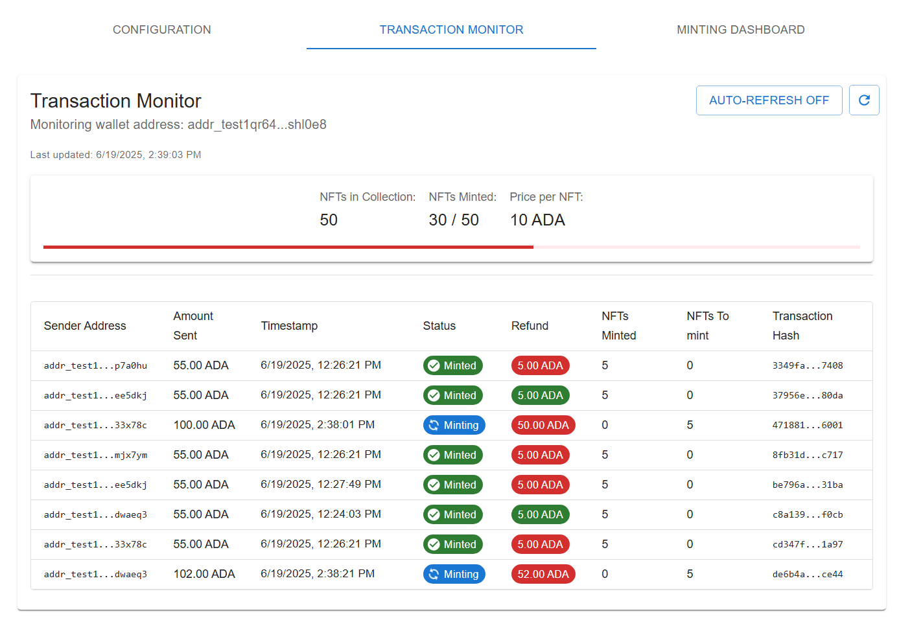
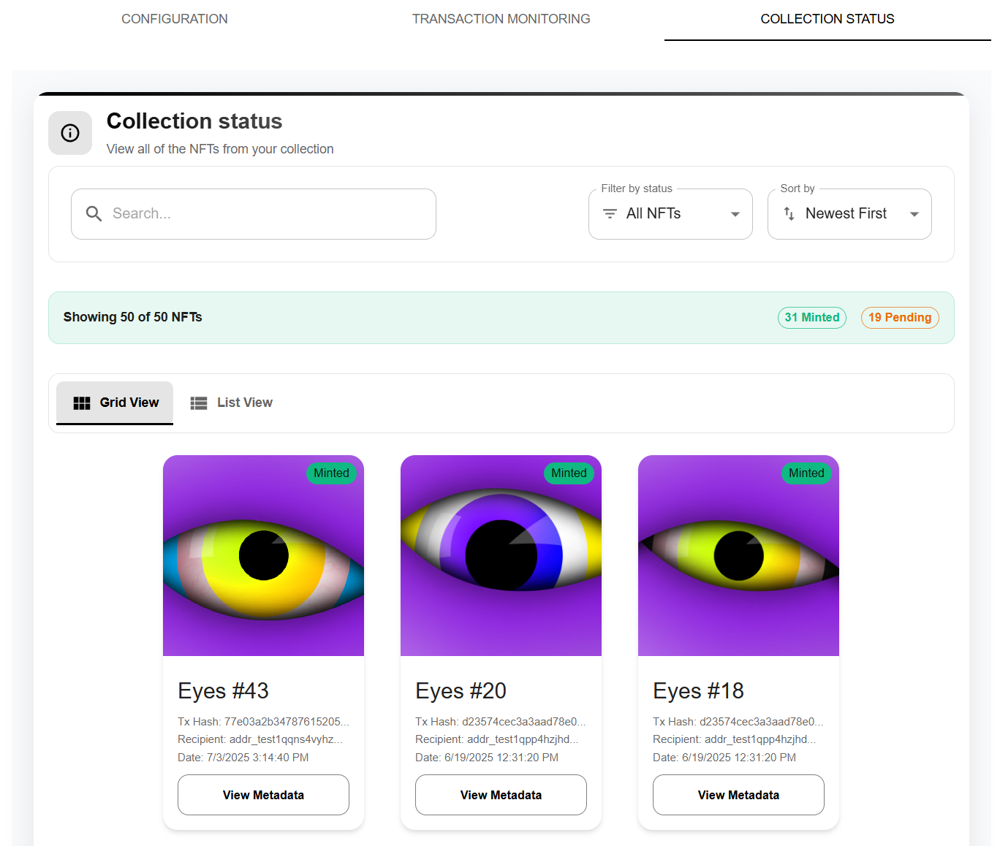

# Cardano NFT Vending Machine

A full-stack Cardano NFT vending app that lets project creators configure and manage NFT drops with automated minting and transaction handling. Built with React, Java Spring, MySQL, and Docker. Seamless integration with the Eternl wallet, Cardano blockchain, and Blockfrost API.

---


## Live Demo

Live App: [NFT vending machine](https://iamaurimas.xyz/vendingmachine/)


## Screenshots

### Configuration panel

[](images/configuration_panel.png)

### Transaction panel


### NFT minting panel



## Tech Stack

**Frontend:** React, TailwindCSS

**Backend:** Java Spring

**Database:** MySQL

**Blockchain:** Cardano, Blockfrost API

**DevOps:** Docker, Docker Compose


## Features

- Login via Eternl wallet (CIP-30 dApp connector)
- Create NFT collection policies with configurable locking periods
- Upload metadata in JSON format, supporting a dynamic number of attributes
- Upload NFT images to IPFS storage (via backend only)
- Configure minting settings: NFT price, transaction limits and collection limits
- Receive ADA from buyers, then automatically mint and send NFTs on a first-come, first-served basis
- Handle refunds
- Transaction viewer to track incoming ADA payments and monitor NFT status within the collection
- Backend handles all logic off-chain with Blockfrost API
- Supports minting ~30 NFTs per transaction or refunding ~50 users per transaction


## Environment Variables

To run this project, you will need to add the following environment variables to your .env file.

Please refer to the [`.env.example`](./.env.example) file for an example.

### Variables used for backend
Needed to connect to MySQL database and blockfrost API

- `BLOCKFROST_API_KEY`

- `IPFS_API_KEY`

- `RECOVERY_PHRASE` - This wallet will be used to mint NFTs and receive transactions

- `DB_URL`

- `DB_USER`

- `DB_PASSWORD`

### MySQL variables
Used to configure internal MySQL container


- `MYSQL_ROOT_PASSWORD`

- `MYSQL_DATABASE`

- `MYSQL_USER`

- `MYSQL_PASSWORD`

## Run Locally

To get a local copy up and running follow these steps

### Prerequisites  
- Git  
- Docker & Docker Compose  
- nano or any text editor for `.env` file

Clone the repository

```bash
  git clone https://github.com/Aurimas111/vending_machine_app
```

Go to the project directory

```bash
  cd vending_machine_app
```

Create and fill .env file with variables

```bash
  nano .env
```

Build the frontend Docker image and set the `VITE_API_URL` environment variable to point to the backend API.

```bash
  docker build -f frontend/dockerfile frontend -t aurimas123456/vending_machine_frontend:v1.9 --build-arg VITE_API_URL=http://localhost:8080/api/minter/
```
Pull backend image from Docker Hub
```bash
  docker pull aurimas123456/vending_machine_backend:v1.1
```

Pull MySQL database image from Docker Hub
```bash
  docker pull aurimas123456/custom_mysql_db:v1.1
```
Start the app 
```bash
  docker compose up
```
The app should be running on `http://localhost/vendingmachine/`
## Test data & usage

 - Use [Eternl wallet](https://eternl.io/) set to the Preprod network
 - Test ADA can be acquired from a [faucet](https://docs.cardano.org/cardano-testnets/tools/faucet) (also set to Preprod network)
 - Test metadata can be accessed at [sample metadata](./metadata.json)

## Authors

- [@Aurimas111](https://www.github.com/Aurimas111)

